<!-- # Capstone Project
## Machine Learning Engineer Nanodegree -->
Chris Kaschner 2016-08-8

## I. Definition
<!-- _(approx. 1-2 pages)_ -->

### Project Overview

An [estimated 2 trillion photos](http://ben-evans.com/benedictevans/2015/8/19/how-many-pictures) were shared online in 2015, with that number expected to continue to grow.  Lacking efficient methods to examine and identify objects in these images they can only be understood by the text that is used to summarize or tag them and not the actual image content.

Is there a way to be able to identify the objects in an image to be able to know what brands are present in an image?  This type of structured data is already [available for text][available for text] but what about images?  What if a customer had an issue and posted an image without your company name in the text description?  How would you could you identify and find such images?

In this project I create a Convolutional Neural Network (CNN) that is capable of identifying brands in untagged/ unlabeled photos from a social media feed.  The model I use implements a [previously trained][previously trained] network and [transfer learning] to speed training.  This project was [inspired][inspired] by a [number][number] of [different][different] sources.

[previously trained]:https://github.com/tensorflow/models/tree/master/inception
[available for text]:(https://www.diffbot.com/)
[transfer learning]:(https://en.wikipedia.org/wiki/Inductive_transfer)
[inspired]:(https://www.youtube.com/watch?v=0Ho0O1tvcU4)
[number]:(https://sightengine.com/)
[different]:(https://research.googleblog.com/2016/03/train-your-own-image-classifier-with.html)

<!-- *In this section, look to provide a high-level overview of the project in layman’s terms. Questions to ask yourself when writing this section:
- _Has an overview of the project been provided, such as the problem domain, project origin, and related datasets or input data?_
- _Has enough background information been given so that an uninformed reader would understand the problem domain and following problem statement?_* -->

#### Problem Statement

Can you teach a computer to recognize  the brand logos of Nike and Altra in an unlabeled feed of images from Instagram?

In order to solve this problem I undertake the following:
1. Identify suitable existing neural networks trained for image recognition and classification
1. Implement the existing models locally and load pretrained weights
1. Obtain a dataset of images to retrain the network on the brands of interest
1. Reconfigure the final layers of the pre-existing models to classify the brands
1. Retrain the final layers of the new network using my dataset
1. Measure resulting performance
1. Optimize the model based on results

This project solves a classification problem.  In its first incarnation discerning between 2 brands represents a _supervised binary classification_ problem.  In this case, selecting whether [Nike](http://www.nike.com/) or [Altra](https://www.altrarunning.com/) products are present.

Later, when a third category is introduced it becomes a _supervised multiclass classification_ problem.  [This website offers](https://medium.com/@ageitgey/machine-learning-is-fun-80ea3ec3c471#.rrxfc4qgh) a great layman's introduction to these concepts.

#### Metrics

There are 2 metrics I use to gauge the performance of my model: accuracy and cross-entropy.  

##### Accuracy
The accuracy is the primary measure of overall model performance.  It is represented as a percentage of the number of images the model correctly identified divided by the total number of attempts.

Accuracy should improve as our model iterates, as shown below:
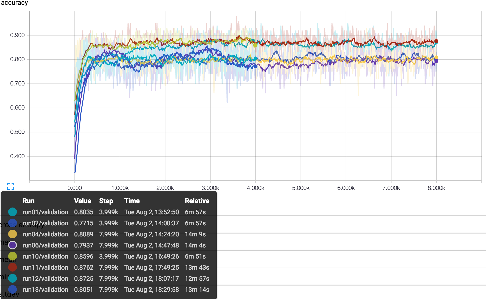

##### Cross-Entropy
Cross-entropy is a measure of a model's loss or cost.  A high value represents a model doing a poor job thus we seek to minimize the cross-entropy.   A more in-depth discussion of cross-entropy is [available here](http://neuralnetworksanddeeplearning.com/chap3.html#the_cross-entropy_cost_function)

In general, we expect to see cross-entropy decreasing as our model iterates, like this:
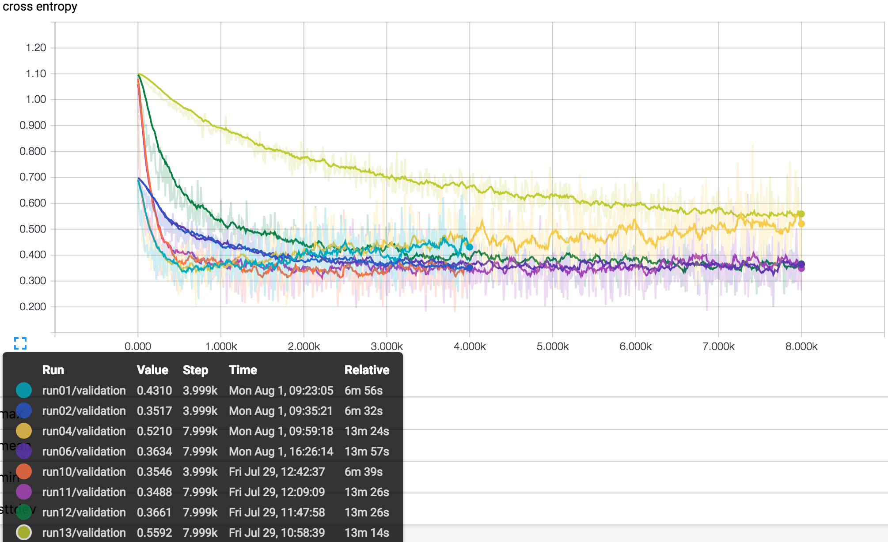

If cross-entropy begins diverging the model is overfitting and some changes are required.  This can be seen in Run04:
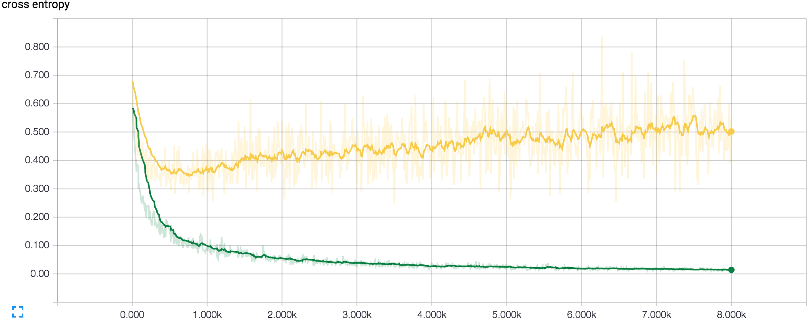

Overfitting occurs when a model is describing randomness and/ or noise in a dataset instead of the underlying relationship.  

In the above chart, the blue line represents an overly complex polynomial function that perfectly describes a linear relationship between the points.

To reduce and mitigate overfitting, we split our images into 3 categories.

1. Training Data - 80% of the images are used for the model to learn from
2. Validation Data - 10% of the images are used for periodic "checking" of our model during training
3. Test Data - 10% of the images are used only once to predict real world results of our model against images it has never seen.

By using these 2 metrics we'll be able to quantify how well our model is performing via the accuracy but also how well the model is *learning* via the cross entropy.

<!-- *In this section, you will need to clearly define the metrics or calculations you will use to measure performance of a model or result in your project. These calculations and metrics should be justified based on the characteristics of the problem and problem domain. Questions to ask yourself when writing this section:
- _Are the metrics you’ve chosen to measure the performance of your models clearly discussed and defined?_
- _Have you provided reasonable justification for the metrics chosen based on the problem and solution?_* -->

## II. Analysis
<!-- _(approx. 2-4 pages)_ -->
### Data Exploration

2 datasets were used in this project.  The majority of the images were downloaded from Instagram and represent the typical input image that could be expected from a direct feed of images flowing into Instagram at any given time.  Tags were used to search for the Altra & Nike images.  An example search and results can [be seen here](https://www.instagram.com/explore/tags/altra/).

#### Examples of Altra and Nike logos
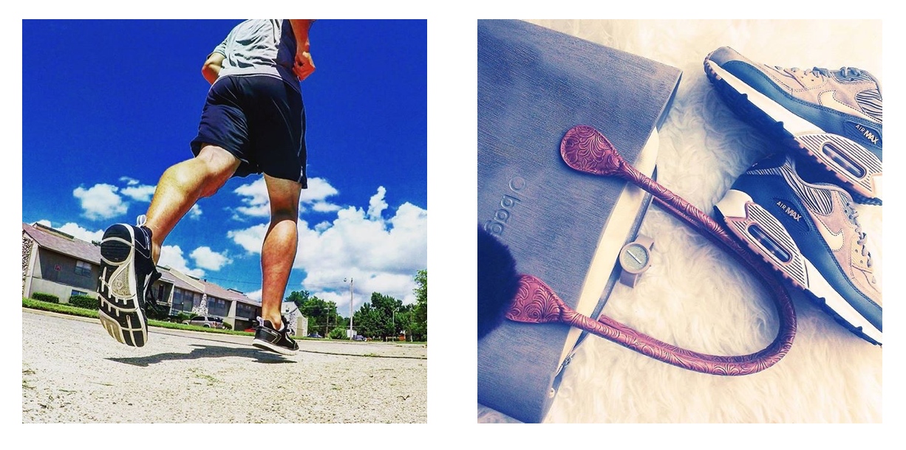

#### First data set

310 images were downloaded from Instagram as square format .jpegs with an edge length of 640 pixels.  They represented 200 images in the Nike category and 110 images in the Altra category.

#### Second data set

The second dataset was made up of the entirety of the first dataset supplemented by additional images in each category.  In total it constituted 240 Altra, 260 Nike, and 453 'neither' images.

The 'neither' category of images is comprised of downloading the bulk "firehose" of images from Instagram.

To supplement this data set, as well as test my models' performance on perturbations in input image shape, approximately 10% of the images are from alternative sources such as Pinboard, Facebook, or Google Image Search.  Thus not all of the input images are square and their resolutions vary.

#### Examples of difficult images

Within the dataset there are a number of images that are difficult to classify.  Here are some examples and explanations of those images in the dataset.

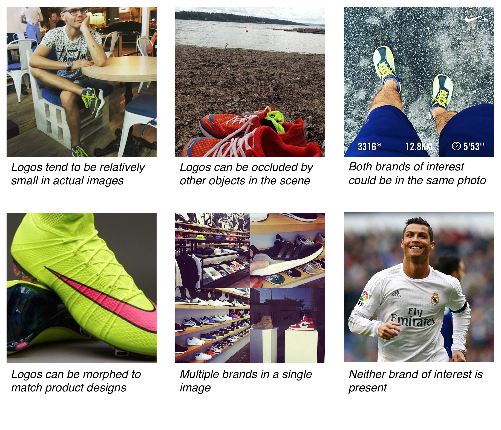

<!-- *In this section, you will be expected to analyze the data you are using for the problem. This data can either be in the form of a dataset (or datasets), input data (or input files), or even an environment. The type of data should be thoroughly described and, if possible, have basic statistics and information presented (such as discussion of input features or defining characteristics about the input or environment). Any abnormalities or interesting qualities about the data that may need to be addressed have been identified (such as features that need to be transformed or the possibility of outliers). Questions to ask yourself when writing this section:
- _If a dataset is present for this problem, have you thoroughly discussed certain features about the dataset? Has a data sample been provided to the reader?_
- _If a dataset is present for this problem, are statistics about the dataset calculated and reported? Have any relevant results from this calculation been discussed?_
- _If a dataset is **not** present for this problem, has discussion been made about the input space or input data for your problem?_
- _Are there any abnormalities or characteristics about the input space or dataset that need to be addressed? (categorical variables, missing values, outliers, etc.)_* -->

### Algorithms and Techniques

"No one teaches a [child how to see](http://www.ted.com/talks/fei_fei_li_how_we_re_teaching_computers_to_understand_pictures)" and in a similar way, instead of defining algorithms to explicitly define every permutation of logo that we would potentially see, neural networks allow us to feed training images to a model and allow it to define for itself what features are critical to classifying our images.

[Convolutional neural networks](http://deeplearning.net/tutorial/lenet.html) are a subtype of [neural network](http://neuralnetworksanddeeplearning.com) that are [extremely effective]((http://bits.blogs.nytimes.com/2014/08/18/computer-eyesight-gets-a-lot-more-accurate/) at image classification.

They approach, or occasionally exceed, [human performance](http://karpathy.github.io/2014/09/02/what-i-learned-from-competing-against-a-convnet-on-imagenet/) on similar benchmarks.

The method I used to approach this problem utilized the significant work that large companies and research institutions have invested into this problem in the form of reusable networks and architectures.  Instead of creating a CNN from scratch I was able to select a suitable network from a number of freely available options and for my project I have selected 2 different networks: VGG16 and Inception v3.

##### VGG16

The VGG model was created by the Visual Geometry Group (VGG) at Oxford University and was [first described in 2015](http://arxiv.org/pdf/1409.1556.pdf). Although there are multiple versions the one used in this work is 16-layers.

##### Inception
The Inception architecture [first appeared in a model called "GoogLeNet"](https://arxiv.org/abs/1409.4842) in 2014.  Version 3 [was described](http://arxiv.org/pdf/1512.00567v3.pdf) in 2015 and is the model used in this work.

#### Transfer Learning & Pre-trained networks

Training a large and complex CNN is a nontrivial task.  For example, training the Inception v3 network which [has over 27 million parameters]((http://blog.kubernetes.io/2016/03/scaling-neural-network-image-classification-using-Kubernetes-with-TensorFlow-Serving.html), would take approximately 2 weeks to train on $50k worth of computer hardware and would need several *million* images.  

##### Inception v3 network

By using [transfer learning](https://papers.nips.cc/paper/5347-how-transferable-are-features-in-deep-neural-networks.pdf) a model that was created at Google and trained on their enormous image library can be used for our image classification task of ~500 images total.  This technique relies on the inherent ability of neural networks that have been trained on one classification task to [be effective]((http://www.kdnuggets.com/2015/08/recycling-deep-learning-representations-transfer-ml.html)) at recognizing features in new tasks.

Replacing the final layer of a previously trained network and replacing it with our preferred classifications allows us to leverage the power of a network that may have been trained for weeks on an array of high-powered GPUs and retraining it in a few minutes for our task.

##### Process to implement

1. Identify a suitable framework or library to build a pre-trained network

    There are a number of different options for building and and loading existing network architectures. [Caffe](http://caffe.berkeleyvision.org/), [Keras](https://github.com/fchollet/keras), and [TensorFlow](https://github.com/tensorflow/tensorflow) are all excellent options.

    For the purpose of my project I limited my choices to Keras & TensorFlow.  Their descriptions from their developers are provided below:
    ##### Keras
    > [Keras](https://github.com/fchollet/keras) is a minimalist, highly modular neural networks library, written in Python and capable of running on top of either TensorFlow or Theano. It was developed with a focus on enabling fast experimentation. Being able to go from idea to result with the least possible delay is key to doing good research.

    ##### TensorFlow
    > [TensorFlow](https://github.com/tensorflow/tensorflow) is an open source software library for numerical computation using data flow graphs. Nodes in the graph represent mathematical operations, while the graph edges represent the multidimensional data arrays (tensors) that flow between them. This flexible architecture lets you deploy computation to one or more CPUs or GPUs in a desktop, server, or mobile device without rewriting code. TensorFlow also includes TensorBoard, a data visualization toolkit.
    TensorFlow was originally developed by researchers and engineers working on the Google Brain team within Google's Machine Intelligence research organization for the purposes of conducting machine learning and deep neural networks research

2. Construct an existing network

    Keras provides [a tutorial](https://blog.keras.io/building-powerful-image-classification-models-using-very-little-data.html) on loading and utilizing the VGG16 architecture.

    TensorFlow [provides instructions](https://www.tensorflow.org/versions/master/how_tos/image_retraining/index.html)  for the reuse of the Inception v3 network.

3. Load pre-trained weights into the previously built network

    The weights that effectively "remember" the training of a neural network are loaded.  In some cases these weight files can be quite large.  For the VGG16 model [the weight file](https://gist.github.com/baraldilorenzo/07d7802847aaad0a35d3) topped 550 mb

4. Modify the pre-existing model for our classification tasks

  Remove the original model's top layers and replace with ones suitable to perform our classification tasks.

5. Update the bottlenecks

  The penultimate layers of the model that perform the actual classification.

6. Retrain the network on my images of interest

  I investigate 2 options- binary classification or a closed world problem where images of only Nike or Altra shoes are expected and and open world multiclass classification of images that could be of Nike or Altra shoes or some third category I've cleverly titled 'Neither'.

7. Evaluate model performance

  Using training, validation, and testing values for accuracy and cross-entropy

8. Optimize hyperparameters and compare performance

9. Select the optimum solution

<!-- In this section, you will need to discuss the algorithms and techniques you intend to use for solving the problem. You should justify the use of each one based on the characteristics of the problem and the problem domain. Questions to ask yourself when writing this section:
- _Are the algorithms you will use, including any default variables/parameters in the project clearly defined?_
- _Are the techniques to be used thoroughly discussed and justified?_
- _Is it made clear how the input data or datasets will be handled by the algorithms and techniques chosen?_ -->

#### Exploratory Visualization

It is important to remember that computers do not "see" images in the same way as humans.  One way to help us to understand how a CNN is "viewing" an image is to visualize the inputs that would maximize different layers of our network.  Using the VGG16 model and [the process described here](https://blog.keras.io/how-convolutional-neural-networks-see-the-world.html) we can see what a neural network would characterize as an ideal input.

##### From the first convolutional layer:
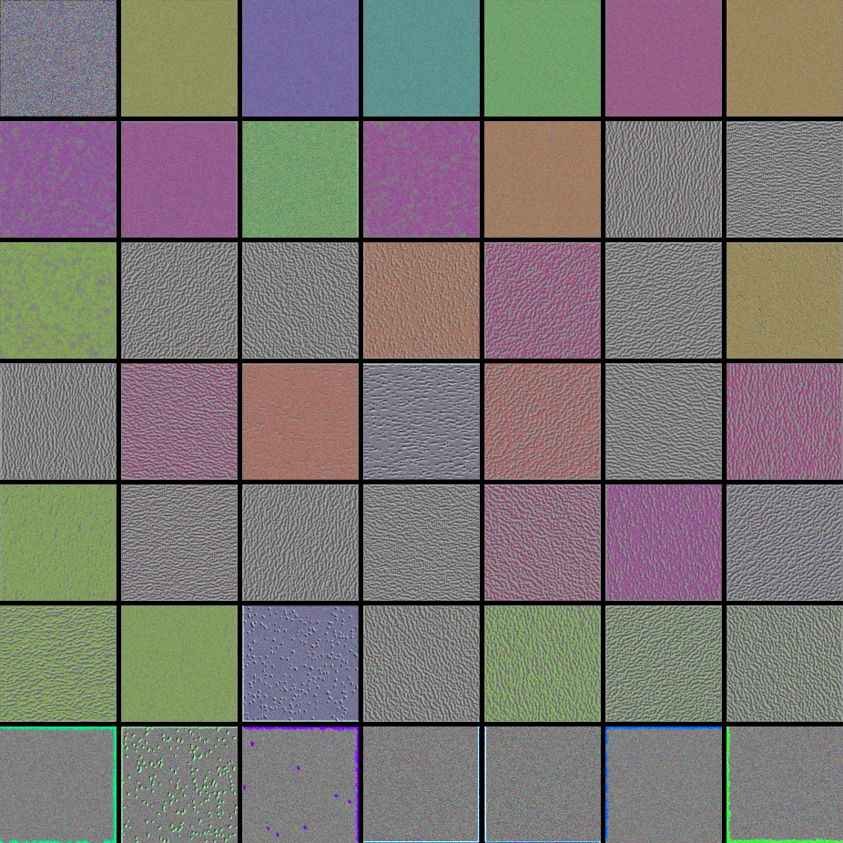

##### From the last convolutional layer:
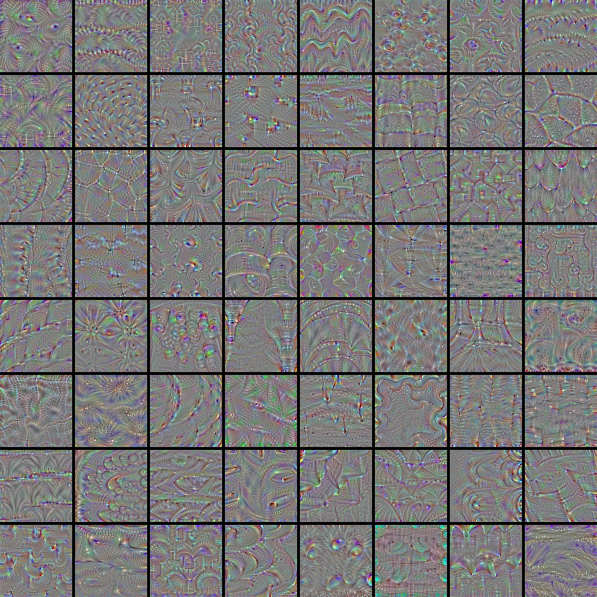

Examining different layers within our neural network, we can begin to appreciate how our network is building up features to identify objects.  We can also start to understand what a network can "see".

<!-- In this section, you will need to provide some form of visualization that summarizes or extracts a relevant characteristic or feature about the data. The visualization should adequately support the data being used. Discuss why this visualization was chosen and how it is relevant. Questions to ask yourself when writing this section:
- _Have you visualized a relevant characteristic or feature about the dataset or input data?_
- _Is the visualization thoroughly analyzed and discussed?_
- _If a plot is provided, are the axes, title, and datum clearly defined?_ -->

### Benchmark

Running the initial CNN with default values as seen from [this tutorial](https://www.tensorflow.org/versions/master/how_tos/image_retraining/index.html) yields a result of 87.8% test accuracy on the simplest form of binary classification- only selecting Nike or Altra and the smaller our two datsets

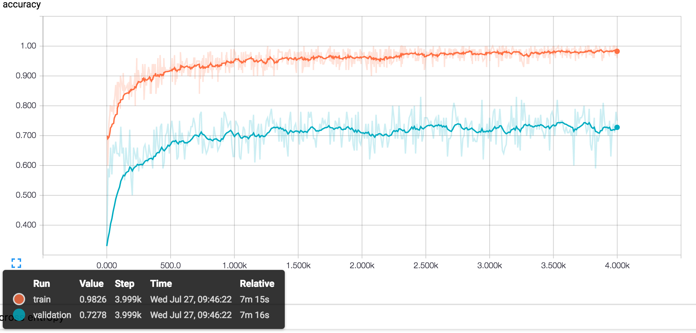
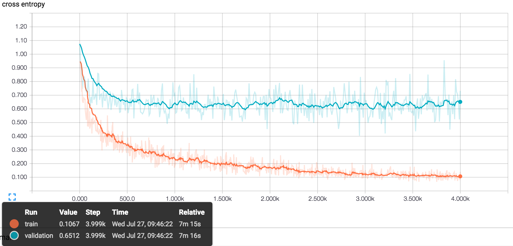

How does it do on the difficult images we identified previously?

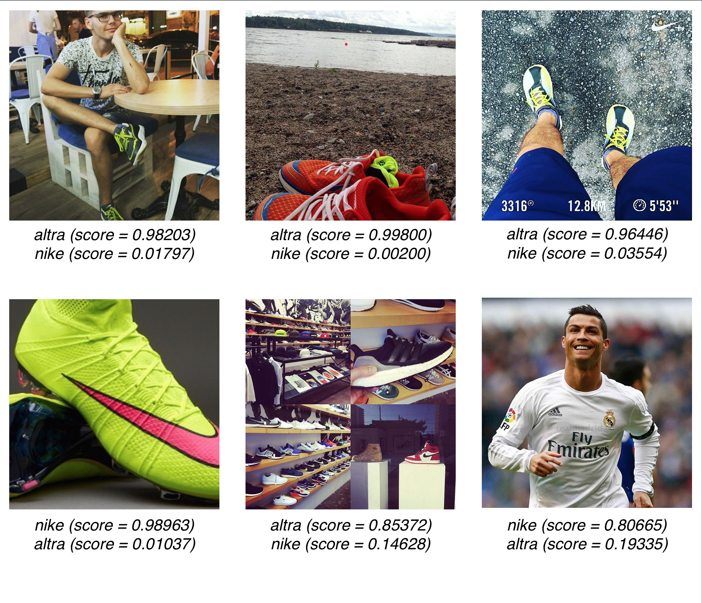

<!-- In this section, you will need to provide a clearly defined benchmark result or threshold for comparing across performances obtained by your solution. The reasoning behind the benchmark (in the case where it is not an established result) should be discussed. Questions to ask yourself when writing this section:
- _Has some result or value been provided that acts as a benchmark for measuring performance?_
- _Is it clear how this result or value was obtained (whether by data or by hypothesis)?_ -->

## III. Methodology
<!-- _(approx. 3-5 pages)_ -->

### Data Preprocessing

#### Premodel Level - Image transformations

One way to improve my data set is to crop the images in a way that highlights the features that I'm interested in extracting.  Cropping the images of shoes so that the logo is the most prominent aspect of the image helps clearly define the features that need to be recognized in the images.

The following image provides an example- the original image contains 3 samples of the Nike logo.  By training on the original image as well as the 2 cropped versions of just the logo increases the number of training images as well as our models' ability to differentiate the Nike logo in images.

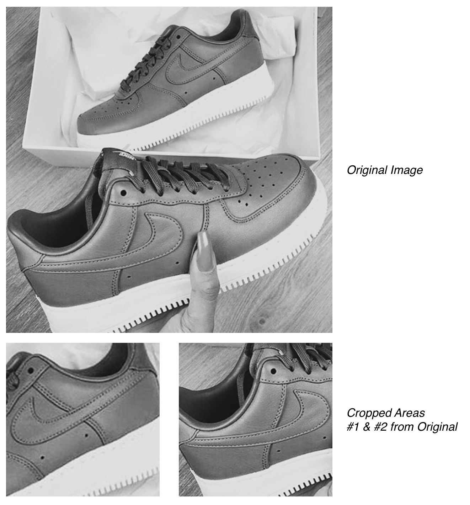

Adobe Lightroom was used to load, crop, and export images in both the Altra and Nike categories.  The resulting images were used to supplement both datasets.

#### Model Level
The model itself handles data preprocessing steps including:

1. Images randomly split into training, validation, and testing sets
1. Resized so that the longest edge is 299 pixels wide/ tall
1. Reshaped into 299x299x3 array for Preprocessing

<!-- In this section, all of your preprocessing steps will need to be clearly documented, if any were necessary. From the previous section, any of the abnormalities or characteristics that you identified about the dataset will be addressed and corrected here. Questions to ask yourself when writing this section:
- _If the algorithms chosen require preprocessing steps like feature selection or feature transformations, have they been properly documented?_
- _Based on the **Data Exploration** section, if there were abnormalities or characteristics that needed to be addressed, have they been properly corrected?_
- _If no preprocessing is needed, has it been made clear why?_ -->

### Implementation

The following steps were performed to create the final model:
1. Construct the Inception v3 network in TensorFlow
1. Load pre-trained weights into the previously built network
1. Modify the pre-existing model for our classification tasks
1. Update the bottlenecks
1. Retrain the network on images of interest
1. Record & Evaluate model performance

In order to reconstruct these results locally, follow the TensorFlow [tutorial](https://www.tensorflow.org/versions/master/how_tos/image_retraining/index.html) on transfer learning and retraining.  Once you have that setup, replace the existing `retrain.py` file with the version [here](). [###todo github link for retrain.py] and the dataset available [here](dropbox.com)[###todo link to dataset].

#### Initial Results

<!-- *In this section, you will want to clearly define the problem that you are trying to solve, including the strategy (outline of tasks) you will use to achieve the desired solution. You should also thoroughly discuss what the intended solution will be for this problem. Questions to ask yourself when writing this section:
- _Is the problem statement clearly defined? Will the reader understand what you are expecting to solve?_
- _Have you thoroughly discussed how you will attempt to solve the problem?_
- _Is an anticipated solution clearly defined? Will the reader understand what results you are looking for?_* -->

18 runs total are shown below.  Some underperforming trials are omitted for clarity and brevity.

##### Training

##### Validation

<!-- In this section, the process for which metrics, algorithms, and techniques that you implemented for the given data will need to be clearly documented. It should be abundantly clear how the implementation was carried out, and discussion should be made regarding any complications that occurred during this process. Questions to ask yourself when writing this section:
- _Is it made clear how the algorithms and techniques were implemented with the given datasets or input data?_
- _Were there any complications with the original metrics or techniques that required changing prior to acquiring a solution?_
- _Was there any part of the coding process (e.g., writing complicated functions) that should be documented?_ -->

### Refinement

Our benchmark test accuracy of 87.8% only describes the case of binary classification.  By adding the items below my model achieves a similar level of accuracy with a more complex multiclass classification problem set before it.

##### Not just binary classification:
   Importantly I also wanted to differentiate between the brands of interest and other shoes/ brands.  I.E. I didn't want to categorize everything as either Nike or Altra, but rather be able to know that an image did not contain one of the logos I was tracking.  To implement, I added a third image category title "neither" comprised of a random selection of images that represented anythings that was not a Nike or Altra item.

##### Additional images
  The most straightforaward way to improve results from a neural network is to [increase the amount of data](http://matroid.com/scaledml/slides/jeff.pdf) being used to train that network.  The second dataset was added to increase the number of images in the training pool.

##### Hyperparameter Search
  Once my initial network was functioning there are a number of different hyperparamters available that can be varied to potentially improve model performance.  They include:
  * Learning Rate (η)
    * How big of a step to take along the gradient of descent.
  * Number of iterations
    * How many training steps to take.
  * Optimizer Type
    * [Stochastic Gradient Descent](https://www.tensorflow.org/versions/r0.10/api_docs/python/train.html#GradientDescentOptimizer) (SGD) - most common.
    * [Adaptive Gradient](http://www.jmlr.org/papers/volume12/duchi11a/duchi11a.pdf) or "Adagrad" that adapts the learning rate and utilizes an accumulator value (δ) that is typically between [0.01]((http://sebastianruder.com/optimizing-gradient-descent/index.html#adagrad) and [0.1](https://www.tensorflow.org/versions/r0.10/api_docs/python/train.html#AdagradOptimizer)

<!-- In this section, you will need to discuss the process of improvement you made upon the algorithms and techniques you used in your implementation. For example, adjusting parameters for certain models to acquire improved solutions would fall under the refinement category. Your initial and final solutions should be reported, as well as any significant intermediate results as necessary. Questions to ask yourself when writing this section:
- _Has an initial solution been found and clearly reported?_
- _Is the process of improvement clearly documented, such as what techniques were used?_
- _Are intermediate and final solutions clearly reported as the process is improved?_ -->

## IV. Results
### Model Evaluation and Validation

Approximately 20 different runs were conducted across a number of different hyperparameters.

Ranked by test accuracy, here are the top results.

|Top  Results|
|----|-----|------|------|------|------|------|
|  Run #  |Test Accuracy| Iterations |Learning Rate (η) |Data Set| Classification | Optimizer |
| 6       |   97.4%     |     8,000  |  0.001       |  First | Binary         | SGD       |
| 2       |   96.8%     |     4,000  |  0.001       |  First | Binary         | SGD       |
| 20      |   88.6%     |     8,000  |  0.001       |  Second| Multiclass     | Adagrad (0.01)  |
| 19      |   87.4%     |     8,000  |  0.001       |  Second| Multiclass     | Adagrad (0.1)  |

Comparing the training and validation scores amongst the top results:
##### Training Accuracy
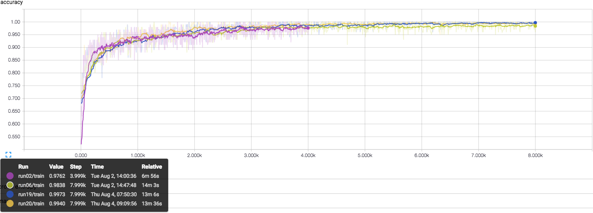

##### Validation Accuracy
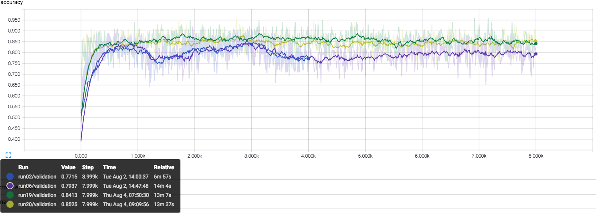

We can also compare cross-entropy between models
##### Training Cross-Entropy
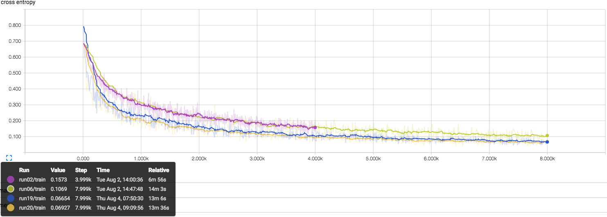

##### Validation Cross-Entropy
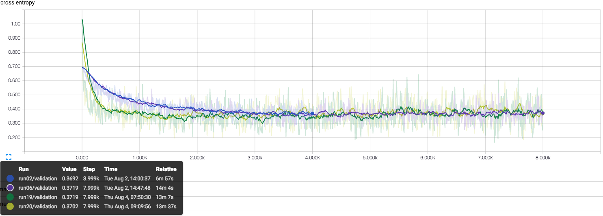

<!-- In this section, the final model and any supporting qualities should be evaluated in detail. It should be clear how the final model was derived and why this model was chosen. In addition, some type of analysis should be used to validate the robustness of this model and its solution, such as manipulating the input data or environment to see how the model’s solution is affected (this is called sensitivity analysis). Questions to ask yourself when writing this section:
- _Is the final model reasonable and aligning with solution expectations? Are the final parameters of the model appropriate?_
- _Has the final model been tested with various inputs to evaluate whether the model generalizes well to unseen data?_
- _Is the model robust enough for the problem? Do small perturbations (changes) in training data or the input space greatly affect the results?_
- _Can results found from the model be trusted?_ -->

### Justification

#### Top Results Binary
|Top  Results|
|----|-----|------|------|------|------|------|
|  Run #  |Test Accuracy| Iterations |Learning Rate (η) |Data Set| Classification | Optimizer |
| 6       |   97.4%     |     8,000  |  0.001       |  First | Binary         | SGD       |

#### Top Results Multiclass
|Top  Results|
|----|-----|------|------|------|------|------|
|  Run #  |Test Accuracy| Iterations |Learning Rate (η) |Data Set| Classification | Optimizer |
| 20      |   88.6%     |     8,000  |  0.001       |  Second| Multiclass     | Adagrad (0.01)  |

#### Revisiting Difficult Photos

Despite improvements to our model, we can see from the below that there remains images that are difficult to classify.  Although these results do not show 100% accuracy, for my purposes I prefer that the model "fails" to the neither category (a false negative).  Previously, in the binary classification model, the model would fail to one of the brands of interest (false positive).

#### Binary

#### Multiclass

<!-- In this section, your model’s final solution and its results should be compared to the benchmark you established earlier in the project using some type of statistical analysis. You should also justify whether these results and the solution are significant enough to have solved the problem posed in the project. Questions to ask yourself when writing this section:
- _Are the final results found stronger than the benchmark result reported earlier?_
- _Have you thoroughly analyzed and discussed the final solution?_
- _Is the final solution significant enough to have solved the problem?_ -->

## V. Conclusion
<!-- _(approx. 1-2 pages)_ -->

### Free-Form Visualization

We started with a discussion of how being able to identify problems with your products would permit a company to contact and resolve issues for customers.  So how does our model perform on images of shoes that may require intervention?

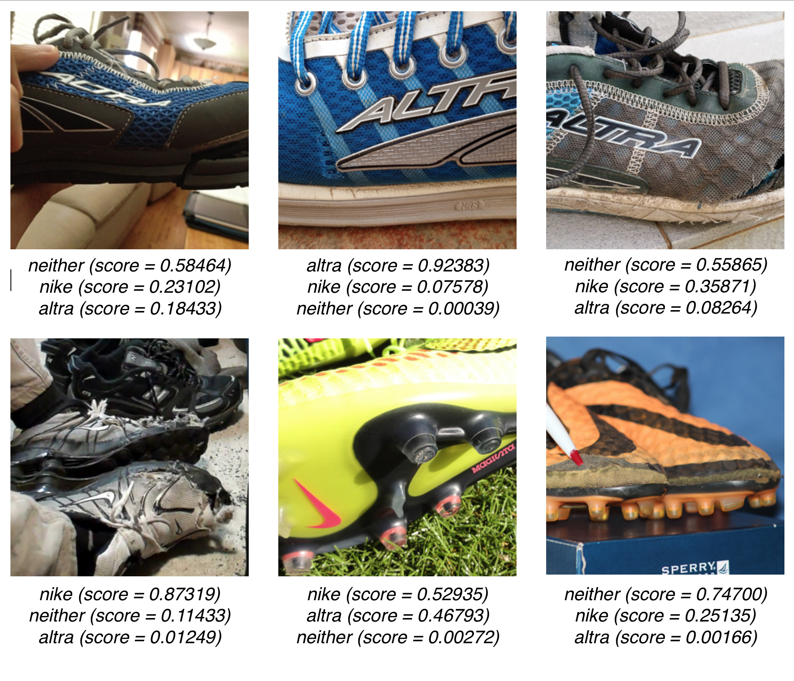

From these results I would say that the model does a good job identifying the brands in the above photos and would provide the ability to find a customers image without any other information.

<!-- In this section, you will need to provide some form of visualization that emphasizes an important quality about the project. It is much more free-form, but should reasonably support a significant result or characteristic about the problem that you want to discuss. Questions to ask yourself when writing this section:
- _Have you visualized a relevant or important quality about the problem, dataset, input data, or results?_
- _Is the visualization thoroughly analyzed and discussed?_
- _If a plot is provided, are the axes, title, and datum clearly defined?_ -->

### Reflection

Steps to create a solution:

1. Identify a suitable framework, TensorFlow, to build a pre-trained network
2. Construct the existing Inception v3 network
1. Create a dataset of images from Instagram
3. Load pre-trained weights into the previously built network
4. Modify the pre-existing model for our classification tasks
5. Update the bottlenecks
6. Retrain the network on images of interest
7. Evaluate model performance
8. Optimize hyperparameters and compare performance
9. Select the optimum solution

There were a number of new, and now that they have been solved, interesting problems that I had to work through in the course of this project.

#### Interesting

Machine learning is unique in that the work that is being done at its highest levels- like that be performed at Google or research institutions can has been released for public use.  What other field allows for the almost immediate implementation of cutting/ bleeding edge technologies by a new practitioner?  The idea of [democratizing](https://blog.keras.io/on-the-importance-of-democratizing-artificial-intelligence.html) artificial intelligence is a call to action to its practitioners.

Applying what I have learned to a real world dataset proved immensely empowering and rewarding.  Being able to use my coursework on things found "out in the wild" was a powerful way to implement things that I had studied on an actual problem and not just a "toy" dataset.

TensorFlow & Keras are both popular tools in the machine learning community right now and I'm glad I got the opportunity to apply them to a project and gain a better understanding of them.

#### Difficulties

TensorFlow  and Keras were both new resources for me to work with, and both provided great functionality once I was able to learn and implement their features.  Unfortunately they are not without a learning curve and in some cases bugs.  Tracking down and understanding why TensorBoard would not display some of my logged training runs turned out to be an [interesting issue](https://github.com/tensorflow/tensorflow/issues/1587) with how paths are specified.  

Visualizing neural networks proved to be one of the more difficult aspect of the project.  Attempting to build Caffe for its abilities to create visualizations of different layers of a network was quite difficult.  There are a number of dependencies and local customizations needed.  While I will continue to sort through them, they ultimately proved too time consuming to utilize in this project.  Fortunately the Keras documentation is excellent and provided an alternative method for visualizations.

#### expectations
My final model performs better than I expected.  The accuracy of predictions was nearly 90% for multiclass classification which was beyond my expectation.  Especially in light of the relatively small dataset provided for training.  ~90% accuracy with ~500 images across 3 classes is an excellent result.

<!-- In this section, you will summarize the entire end-to-end problem solution and discuss one or two particular aspects of the project you found interesting or difficult. You are expected to reflect on the project as a whole to show that you have a firm understanding of the entire process employed in your work. Questions to ask yourself when writing this section:
- _Have you thoroughly summarized the entire process you used for this project?_
- _Were there any interesting aspects of the project?_
- _Were there any difficult aspects of the project?_
- _Does the final model and solution fit your expectations for the problem, and should it be used in a general setting to solve these types of problems?_ -->

### Improvement

* implement a web based interface to this model.  Bonus point if you could provide additional information in the event an image was mis-classified.  Remotely using the model would be beneficial in lieu of downloading my Python code and running locally.  Additionally, a web based implementation could be extended to mobile devices as well, negating the need for a mobile based version.
* TensorFlow can be run on a mobile device, extending this work to an iOS or Android device would allow the model to be run remotely.
* Comparing my results to another baseline, such as [PCANet](http://arxiv.org/abs/1404.3606) would be a good gut check of my results.
* Deeper [sensitivity analysis](https://beckmw.wordpress.com/2013/10/07/sensitivity-analysis-for-neural-networks/)
* The network could always be improved by adding additional training images.

<!-- In this section, you will need to provide discussion as to how one aspect of the implementation you designed could be improved. As an example, consider ways your implementation can be made more general, and what would need to be modified. You do not need to make this improvement, but the potential solutions resulting from these changes are considered and compared/contrasted to your current solution. Questions to ask yourself when writing this section:
- _Are there further improvements that could be made on the algorithms or techniques you used in this project?_
- _If you used your final solution as the new benchmark, do you think an even better solution exists?_

----------- -->
<!--
**Before submitting, ask yourself. . .**

- Does the project report you’ve written follow a well-organized structure similar to that of the project template?
- Is each section (particularly **Analysis** and **Methodology**) written in a clear, concise and specific fashion? Are there any ambiguous terms or phrases that need clarification?
- Would the intended audience of your project be able to understand your analysis, methods, and results?
- Have you properly proof-read your project report to assure there are minimal grammatical and spelling mistakes?
- Are all the resources used for this project correctly cited and referenced?
- Is the code that implements your solution easily readable and properly commented?
- Does the code execute without error and produce results similar to those reported? -->
